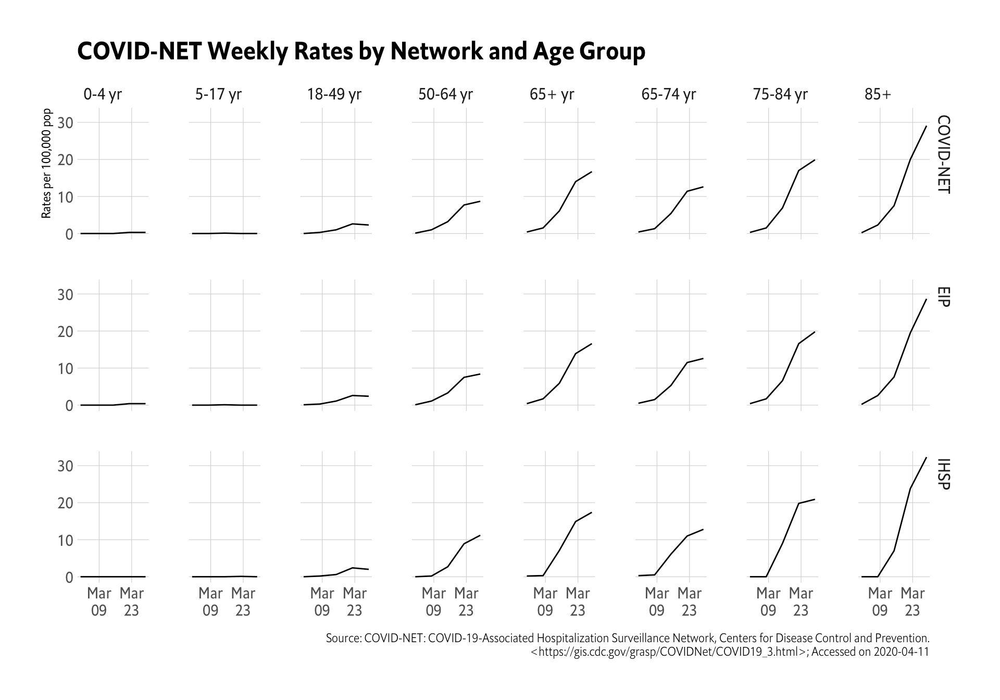

[](https://www.repostatus.org/#active)
[](https://keybase.io/hrbrmstr)

[](https://travis-ci.org/hrbrmstr/cdccovidview)  


# cdccovidview

Weekly Surveillance Summary of U.S. COVID-19 Activity

## Description

The U.S. Centers for Disease Control provides weekly summary and
interpretation of key indicators that have been adapted to track the
COVID-19 pandemic in the United States. Tools are provided to retrive
data from both COVIDView
(<https://www.cdc.gov/coronavirus/2019-ncov/covid-data/covidview/index.html>)
and COVID-NET (<https://gis.cdc.gov/grasp/COVIDNet/COVID19_3.html>).

## What’s Inside The Tin

The following functions are implemented:

  - `about`: Display information about the data source
  - `age_groups`: Return age groups used in the surveillance
  - `available_seasons`: Show available seasons
  - `clinical_labs`: Retrieve U.S. Clinical Laboratories Reporting
    SARS-CoV-2 Test Results to CDC
  - `laboratory_confirmed_hospitalizations`: Retrieve
    Laboratory-Confirmed COVID-19-Associated Hospitalizations
  - `mmwr_week_to_date`: Convert an MMWR year+week or year+week+day to a
    Date object
  - `mmwr_week`: Convert a Date to an MMWR day+week+year
  - `mmwr_weekday`: Convert a Date to an MMWR weekday
  - `mmwrid_map`: MMWR ID to Calendar Mappings
  - `mortality_surveillance_data`: Retrieve NCHS Mortality Surveillance
    Data
  - `nssp_er_visits_national`: Retrieve National Syndromic Surveillance
    Program (NSSP): Emergency Department Visits Percentage of Visits for
    COVID-19-Like Illness (CLI) or Influenza-like Illness (ILI)
  - `nssp_er_visits_regional`: Retrieve Regional Syndromic Surveillance
    Program (NSSP): Emergency Department Visits Percentage of Visits for
    COVID-19-Like Illness (CLI) or Influenza-like Illness (ILI)
  - `provisional_death_counts`: Retrieve Provisional Death Counts for
    Coronavirus Disease (COVID-19)
  - `public_health_labs_national`: Retrieve National Surveillance of
    U.S. State and Local Public Health Laboratories Reporting to CDC
  - `public_health_labs_regional`: Retrieve Regional Surveillance of
    U.S. State and Local Public Health Laboratories Reporting to CDC
  - `surveillance_areas`: Show network & network catchments

## Installation

``` r
install.packages("cdccovidview", repos = c("https://cinc.rud.is", "https://cloud.r-project.org/"))
# or
remotes::install_git("https://git.rud.is/hrbrmstr/cdccovidview.git")
# or
remotes::install_git("https://git.sr.ht/~hrbrmstr/cdccovidview")
# or
remotes::install_gitlab("hrbrmstr/cdccovidview")
# or
remotes::install_bitbucket("hrbrmstr/cdccovidview")
# or
remotes::install_github("hrbrmstr/cdccovidview")
```

NOTE: To use the ‘remotes’ install options you will need to have the
[{remotes} package](https://github.com/r-lib/remotes) installed.

## Usage

``` r
library(cdccovidview)

# current version
packageVersion("cdccovidview")
## [1] '0.1.1'
```

``` r
library(cdccovidview)
library(hrbrthemes)
library(tidyverse)

hosp <- laboratory_confirmed_hospitalizations()

hosp
## # A tibble: 4,590 x 8
##    catchment      network   year  mmwr_year mmwr_week age_category cumulative_rate weekly_rate
##    <chr>          <chr>     <chr> <chr>     <chr>     <chr>                  <dbl>       <dbl>
##  1 Entire Network COVID-NET 2020  2020      10        0-4 yr                   0           0  
##  2 Entire Network COVID-NET 2020  2020      11        0-4 yr                   0           0  
##  3 Entire Network COVID-NET 2020  2020      12        0-4 yr                   0           0  
##  4 Entire Network COVID-NET 2020  2020      13        0-4 yr                   0.3         0.3
##  5 Entire Network COVID-NET 2020  2020      14        0-4 yr                   0.6         0.3
##  6 Entire Network COVID-NET 2020  2020      15        0-4 yr                  NA          NA  
##  7 Entire Network COVID-NET 2020  2020      16        0-4 yr                  NA          NA  
##  8 Entire Network COVID-NET 2020  2020      17        0-4 yr                  NA          NA  
##  9 Entire Network COVID-NET 2020  2020      18        0-4 yr                  NA          NA  
## 10 Entire Network COVID-NET 2020  2020      19        0-4 yr                  NA          NA  
## # … with 4,580 more rows

c(
  "0-4 yr", "5-17 yr", "18-49 yr", "50-64 yr", "65+ yr", "65-74 yr", "75-84 yr", "85+"
) -> age_f

mutate(hosp, start = mmwr_week_to_date(mmwr_year, mmwr_week)) %>% 
  filter(!is.na(weekly_rate)) %>% 
  filter(catchment == "Entire Network") %>% 
  select(start, network, age_category, weekly_rate) %>%  
  filter(age_category != "Overall") %>% 
  mutate(age_category = factor(age_category, levels = age_f)) %>% 
  ggplot() +
  geom_line(
    aes(start, weekly_rate)
  ) +
  scale_x_date(
    date_breaks = "2 weeks", date_labels = "%b\n%d"
  ) +
  facet_grid(network~age_category) +
  labs(
    x = NULL, y = "Rates per 100,000 pop",
    title = "COVID-NET Weekly Rates by Network and Age Group",
    caption = sprintf("Source: COVID-NET: COVID-19-Associated Hospitalization Surveillance Network, Centers for Disease Control and Prevention.\n<https://gis.cdc.gov/grasp/COVIDNet/COVID19_3.html>; Accessed on %s", Sys.Date())
  ) +
  theme_ipsum_es(grid="XY")
```



### Clinical Labs

``` r
head(clinical_labs())
##     week num_labs tested tested_pos pct_pos   region        source
## 1 202011       26   2785        182   0.065 National Clinical Labs
## 2 202012       41  18494       1149   0.062 National Clinical Labs
## 3 202013       50  37390       2966   0.079 National Clinical Labs
## 4 202014       37  36468       2798   0.077 National Clinical Labs
```

### Public Health Labs

``` r
head(public_health_labs_national())
##     week num_labs tested tested_pos pct_pos age_group   region             source
## 1 202010       73   8049        945   0.117   Overall National Public Health Labs
## 2 202011       79  32072       3292   0.103   Overall National Public Health Labs
## 3 202012       80  63369       6494   0.103   Overall National Public Health Labs
## 4 202013       79  56443       9529   0.169   Overall National Public Health Labs
## 5 202014       75  65917      12177   0.185   Overall National Public Health Labs
## 6 202010       73    212          9   0.043    0-4 yr National Public Health Labs

head(public_health_labs_regional())
##     week num_labs tested tested_pos pct_pos   region             source
## 1 202010        8    619         46   0.074 Region 1 Public Health Labs
## 2 202011       17   3208        194   0.061 Region 1 Public Health Labs
## 3 202012       18   9608        732   0.076 Region 1 Public Health Labs
## 4 202013       16   4625        700   0.151 Region 1 Public Health Labs
## 5 202014       15   6123       1611   0.263 Region 1 Public Health Labs
## 6 202010        5   1381        193   0.140 Region 2 Public Health Labs
```

### Emergency Department Visits

``` r
head(nssp_er_visits_national())
##   week num_fac total_ed_visits visits pct_visits visit_type   region                source year
## 1   40    3255         2146776  19503      0.009        ili National Emergency Departments 2019
## 2   41    3249         2106999  20457      0.010        ili National Emergency Departments 2019
## 3   42    3256         2101358  22515      0.011        ili National Emergency Departments 2019
## 4   43    3254         2122427  23776      0.011        ili National Emergency Departments 2019
## 5   44    3295         2087335  25466      0.012        ili National Emergency Departments 2019
## 6   45    3315         2137854  29948      0.014        ili National Emergency Departments 2019

head(nssp_er_visits_regional())
##   week num_fac total_ed_visits visits pct_visits visit_type   region                source year
## 1   41     202          130377    814      0.006        ili Region 1 Emergency Departments 2019
## 2   42     202          132385    912      0.007        ili Region 1 Emergency Departments 2019
## 3   43     202          131866    883      0.007        ili Region 1 Emergency Departments 2019
## 4   44     203          128256    888      0.007        ili Region 1 Emergency Departments 2019
## 5   45     203          127466    979      0.008        ili Region 1 Emergency Departments 2019
## 6   46     202          125306   1188      0.009        ili Region 1 Emergency Departments 2019
```

### Mortality

``` r
head(mortality_surveillance_data())
##   year week total_deaths deaths pct_deaths    cause   region source
## 1 2019   40        52452      0          0 COVID-19 National   NCHS
## 2 2019   41        52860      0          0 COVID-19 National   NCHS
## 3 2019   42        54129      0          0 COVID-19 National   NCHS
## 4 2019   43        53914      0          0 COVID-19 National   NCHS
## 5 2019   44        53980      0          0 COVID-19 National   NCHS
## 6 2019   45        55468      0          0 COVID-19 National   NCHS
```

``` r
pd <- provisional_death_counts()

head(pd$by_week)
##         week covid_deaths total_deaths percent_expected_deaths pneumonia_deaths pneumonia_and_covid_deaths
## 2 2020-02-01            0        56402                    0.95             3618                          0
## 3 2020-02-08            0        56737                    0.95             3601                          0
## 4 2020-02-15            0        55273                    0.94             3580                          0
## 5 2020-02-22            0        54859                    0.94             3427                          0
## 6 2020-02-29            5        54513                    0.95             3464                          3
## 7 2020-03-07           18        53801                    0.93             3552                         11
##   all_influenza_deaths_j09_j11
## 2                          452
## 3                          483
## 4                          489
## 5                          502
## 6                          573
## 7                          555

head(pd$by_age)
##     age_group covid_deaths total_deaths percent_expected_deaths pneumonia_deaths pneumonia_and_covid_deaths
## 12   All ages         4984       511424                    0.89            36423                       2341
## 13 Under 1 yr            0         2727                    0.65               19                          0
## 14     1-4 yr            1          552                    0.76               27                          1
## 15    5-14 yr            1          809                    0.73               26                          0
## 16   15-24 yr            6         4638                    0.81               87                          2
## 17   25-34 yr           46         9624                    0.86              257                         21
##    all_influenza_deaths_j09_j11
## 12                         4541
## 13                            9
## 14                           26
## 15                           34
## 16                           35
## 17                          106

head(pd$by_state)
##         state covid_deaths total_deaths percent_expected_deaths pneumonia_deaths pneumonia_and_covid_deaths
## 25    Alabama           14         9220                    0.87              539                          4
## 26     Alaska            1          627                    0.75               31                          1
## 27    Arizona           26        11862                    0.97              748                         13
## 28   Arkansas            3         5938                    0.92              372                          2
## 29 California          175        52505                    0.94             4170                         96
## 30   Colorado           62         7787                    0.98              493                         33
##    all_influenza_deaths_j09_j11
## 25                           75
## 26                            3
## 27                           95
## 28                           62
## 29                          511
## 30                           77

head(pd$by_sex)
##        sex covid_deaths total_deaths percent_expected_deaths pneumonia_deaths pneumonia_and_covid_deaths
## 79    Male         2993       262727                    0.90            19129                       1374
## 80  Female         1991       248679                    0.89            17294                        967
## 81 Unknown            0           18                    0.82                0                          0
##    all_influenza_deaths_j09_j11
## 79                         2262
## 80                         2279
## 81                            0
```

## cdccovidview Metrics

| Lang | \# Files |  (%) | LoC | (%) | Blank lines | (%) | \# Lines | (%) |
| :--- | -------: | ---: | --: | --: | ----------: | --: | -------: | --: |
| R    |       18 | 0.95 | 433 | 0.9 |         145 | 0.8 |      173 | 0.8 |
| Rmd  |        1 | 0.05 |  47 | 0.1 |          36 | 0.2 |       44 | 0.2 |

## Code of Conduct

Please note that this project is released with a Contributor Code of
Conduct. By participating in this project you agree to abide by its
terms.
